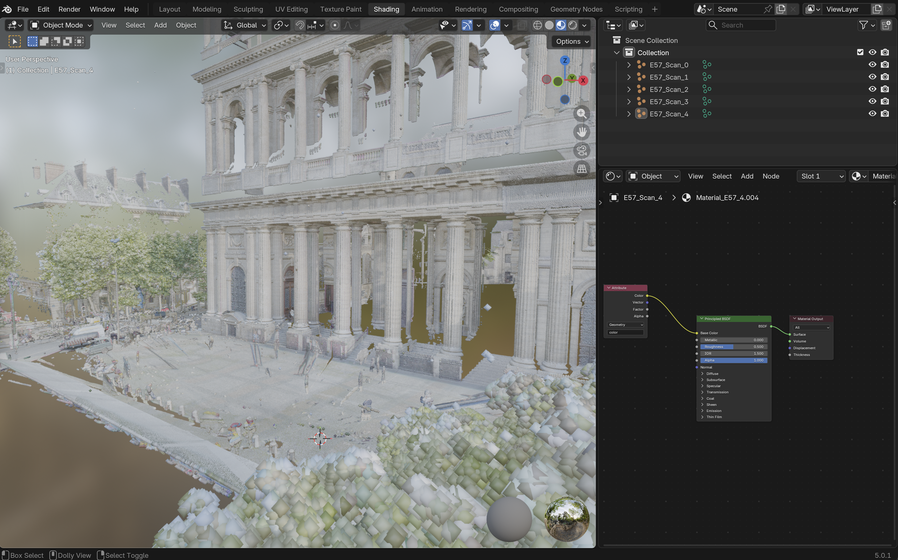

# E57 Point Cloud Importer for Blender

A native extension for Blender 5.0+ to import `.e57` point cloud files directly into Blender's native PointCloud object format. 

Developed by Quentin Misslin.

## About the E57 Format

The ASTM E57 file format is a compact, vendor-neutral standard for storing point clouds, images, and metadata produced by 3D imaging systems, such as LiDAR and laser scanners. 

Unlike proprietary formats, E57 is designed to be universal, making it the industry standard for interoperability between different point cloud processing software.

* [Official E57 Format Documentation](http://www.libe57.org/)
* [Sample E57 Files for Testing](http://www.libe57.org/data.html)

## Features

* **Native PointCloud Object:** Converts E57 data directly into Blender's optimized PointCloud geometry.
* **Offline Dependencies:** Includes pre-compiled `pye57` and `pyquaternion` wheels for Windows, macOS (ARM), and Linux. No internet connection required for installation.
* **Color Extraction:** Automatically extracts RGB data and maps it to the points.
* **Normal Vectors:** Extracts surface normals and builds a toggleable Shader Node tree for orientation visualization.
* **Point Radius Control:** Set the base radius of the points directly from the import menu.
* **Automatic Material Generation:** Creates and assigns a Principled BSDF material with proper attribute routing.

## Requirements

* Blender 5.0.1 or higher.

## Installation

Download the latest release from the Releases page.

Do not extract the ZIP file.
Open Blender and navigate to `Edit > Preferences > Get Extensions`.
Click the drop-down menu in the top right corner and select `Install from Disk`.
Select the downloaded `import_e57.zip` file.
Enable the extension.

## Usage

Navigate to `File > Import > E57 Point Cloud (.e57)`.
In the file browser sidebar, you can adjust:

* **Import Colors:** Extract RGB data.
* **Import Normals:** Extract normal vectors.
* **Scale:** Adjust the global scale of the point cloud.
* **Point Radius:** Adjust the visual size of the points.

Note: To see the point colors in the viewport, ensure you are in `Material Preview` or `Rendered` mode.

## License

This extension is licensed under the [GPL-3.0 License](LICENSE).

**Third-Party Libraries:**
The pre-compiled dependencies included in the `wheels` directory (`pye57` and `pyquaternion`) are distributed under the MIT License. Their original copyrights remain with their respective authors.